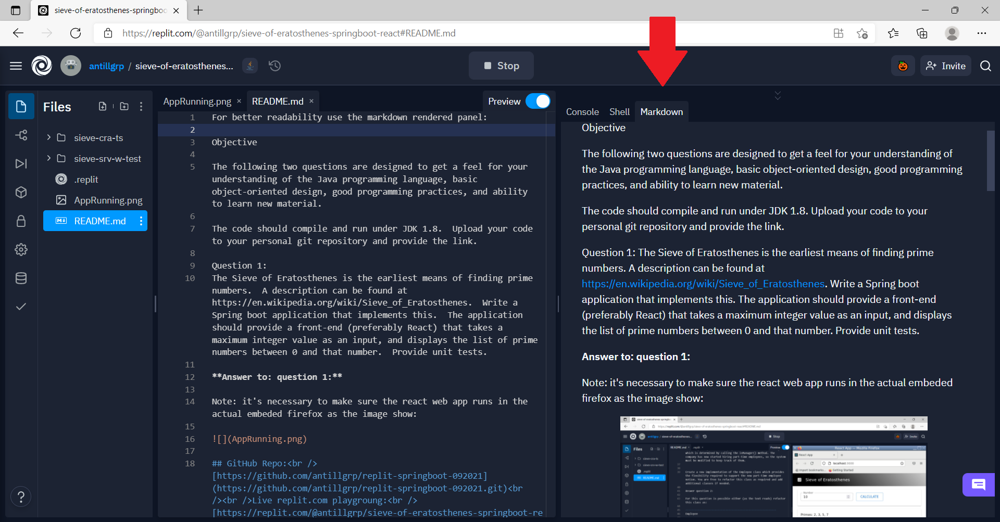
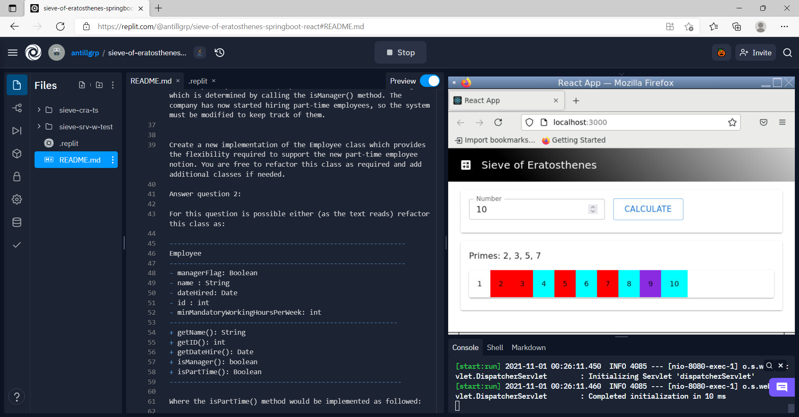

For better readability use the markdown rendered panel:



Objective

The following two questions are designed to get a feel for your understanding of the Java programming language, basic object-oriented design, good programming practices, and ability to learn new material. 

The code should compile and run under JDK 1.8.  Upload your code to your personal git repository and provide the link.

Question 1:
The Sieve of Eratosthenes is the earliest means of finding prime numbers.  A description can be found at https://en.wikipedia.org/wiki/Sieve_of_Eratosthenes.  Write a Spring boot application that implements this.  The application should provide a front-end (preferably React) that takes a maximum integer value as an input, and displays the list of prime numbers between 0 and that number.  Provide unit tests.

## Answer to: question 1:

Note: it's necessary to make sure the react web app runs in the actual embeded firefox as the image show: 



#### GitHub Repo:<br /> [https://github.com/antillgrp/replit-springboot-092021](https://github.com/antillgrp/replit-springboot-092021.git)<br /><br />Live replit.com playgroung:<br /> [https://replit.com/@antillgrp/sieve-of-eratosthenes-springboot-react](https://replit.com/@antillgrp/sieve-of-eratosthenes-springboot-react)
<br />

Question 2:

You are modifying a human resources application. The current Employee class looks like this:
 
|Employee|
|:--------------------------|
|--------------------------|
|- managerFlag: Boolean|
|- name : String|
|- dateHired: Date|
|- id : int|
|--------------------------|
|+ getName(): String|
|+ getID(): int|
|+ getDateHire(): Date|
|+ isManager(): boolean|

Currently everyone is an Employee and some of those are Managers, which is determined by calling the isManager() method. The company has now started hiring part-time employees, so the system must be modified to keep track of them.
 
Create a new implementation of the Employee class which provides the flexibility required to support the new part-time employee notion. You are free to refactor this class as required and add additional classes if needed. 

## Answer question 2:

For this question is possible either (as the text reads) refactor this class as:

|Employee|
|:--------------------------|
|--------------------------|
|- managerFlag: Boolean|
|- name : String|
|- dateHired: Date|
|- id : int|
|**- minMandatoryWorkingHoursPerWeek: int**|
|--------------------------|
|+ getName(): String|
|+ getID(): int|
|+ getDateHire(): Date|
|+ isManager(): boolean|
|**+ isPartTime(): Boolean**|

Where the isPartTime() method would be implemented as followed:

```
const FullTimeHoursPerWeekCompanyPolicy = 40;

boolean isPartTime() {

	return minMandatoryWorkingHoursPerWeek < FullTimeHoursPerWeekCompanyPolicy

}
```

Assuming that every employee that works less than 40 h/week (this depends on the company’s policy) is considered part-time:

Also, is possible to (if the previous implementation allows it) to inherit from Employee to define a new type (class) that includes the minimum mandatory hours per week information and knowing if  an Employee instance is part-time is needed to verify if is instance of PartTimeEmployee 

```
Employee

   ∆
   |

PartTimeEmployee
```

|**PartTimeEmployee extends Employee**|
|:--------------------------|
|--------------------------------------------------|
|- managerFlag: Boolean|
|- name : String|
|- dateHired: Date|
|- id : int|
|**- minMandatoryWorkingHoursPerWeek: int**|
|--------------------------------------------------|
|+ getName(): String|
|+ getID(): int|
|+ getDateHire(): Date|
|+ isManager(): boolean|

Off course, this might bring (in case Employee is a database entity) some extra database modification, for relational databases (in particular) is possible to create a new table (relation) that match employees with minimum mandatory hours per week. This table would hold only part-time employees 

|id : int|
|:-------|
|minMandatoryWorkingHoursPerWeek: int|

It’s important to note that adding a new feature to a system often demands to maintain a backward compatibility. So it’s necessary to be careful when a change might break the current working business logic.  


